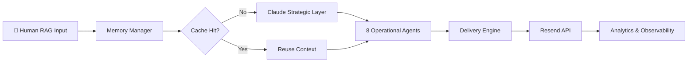

# VRAXIA — Enterprise AI OS

> **Preserve o conhecimento que vai embora antes de ir embora.**
> 8 agentes especializados. 7 departamentos simultâneos. ↓80% custo de inferência. ↑40% eficiência operacional.

[](https://www.typescriptlang.org/)
[](https://anthropic.com)
[](https://nodejs.org)
[](./LICENSE)

---

## O Problema

**75% das empresas familiares brasileiras fecham após a saída do fundador** — não por falta de capital, mas por falta de preservação do conhecimento estratégico (PwC, 2024).

O que vai junto com quem sai:
- Como a empresa toma decisões difíceis
- Por que determinados clientes ficam (e outros não)
- O raciocínio por trás de cada processo crítico

RAG tradicional indexa **o que foi escrito**. Isso não basta.

---

## A Solução — Human RAG

**Human RAG** é um framework original que indexa **como a pessoa pensa e decide** — não apenas documentos.

```
RAG Tradicional:  documento → embedding → busca semântica
Human RAG:        raciocínio → padrão → reconstrução cognitiva
```

Implementado no **VRAXIA** — Enterprise AI OS em produção com 8 agentes especializados operando 7 departamentos corporativos simultaneamente.

**Resultados mensurados em produção:**
| Métrica | Resultado |
|---|---|
| ↓ Custo de inferência IA | **80%** |
| ↑ Eficiência operacional | **40%** |
| ↓ Falhas por contexto perdido | **30%** |
| Custo por lead enriquecido | **< $0.01** |

---

## Arquitetura

```
┌─────────────────────────────────────────────────────────┐
│                  CLAUDE STRATEGIC LAYER                  │
│        Coordinator · Planner · Evaluator · Memory        │
└──────────────────────────┬──────────────────────────────┘
                           │ orchestrates
┌──────────────────────────▼──────────────────────────────┐
│                    OPERATIONAL AGENTS (8)                │
│  Lead Sourcer · Validator · Enricher · Outreach Builder  │
│  Email Sender · Researcher · Vault Agent · Coder         │
└──────────┬───────────────────────────┬───────────────────┘
           │                           │
┌──────────▼──────────┐   ┌────────────▼──────────────────┐
│   HUMAN RAG LAYER   │   │       DELIVERY ENGINE          │
│  SQLite · JSONL RAG │   │  Queue → Worker → Scheduler    │
│  pgvector · Redis   │   │  Rate Limiter → Report         │
└─────────────────────┘   └───────────────────────────────┘
```



---

## Stack

| Camada | Tecnologia |
|---|---|
| Runtime | TypeScript 5 + Node.js 20 (ESM) |
| AI — Estratégico | Claude Opus / Sonnet (Anthropic) |
| AI — Operacional | Claude Haiku / GPT-4o-mini (Cheap Mode) |
| Memória operacional | SQLite local-first |
| RAG semântico | JSONL local + pgvector (escalonamento) |
| Email delivery | Resend API |
| Observabilidade | OpenTelemetry · Winston · Analytics JSONL |
| Infra | Zero-infra local · Docker Compose (opcional) |

---

## Quick Start

```bash
git clone https://github.com/SAMIRRICARDO/ai-cognitive-runtime
cd ai-cognitive-runtime
npm install
cp .env.example .env     # apenas ANTHROPIC_API_KEY obrigatório

# Rodar um agente
npx tsx scripts/run-agent.ts researcher "What is Human RAG?"

# Demo completo — Human RAG em 2 minutos
npx tsx demo/human-rag-demo.ts
```

> **Modo local-first:** zero containers, zero Docker. SQLite e JSONL inicializam automaticamente.

---

## Agentes

| Agente | Função |
|---|---|
| `coordinator` | Decompõe tarefas, coordena pipeline |
| `lead-sourcer` | Aquisição de empresas e contatos |
| `lead-validator` | Scoring estratégico e segmentação |
| `lead-enricher` | Resolução de emails (40+ empresas, 6 padrões) |
| `outreach-builder` | Geração de copy personalizado via Claude |
| `email-sender` | Controle de delivery e relatórios |
| `researcher` | Pesquisa web para contexto e enriquecimento |
| `evaluator` | Reflexão, critique e validação de qualidade |

---

## Cost Governance

Governança em 4 camadas — definida em [`AGENTS.md`](AGENTS.md) e [`config/runtime-config.json`](config/runtime-config.json):

```
1. Model routing    →  Haiku p/ ops · Sonnet p/ orquestração · Opus p/ planejamento
2. Token caps       →  max_tokens ≤ 300 por chamada operacional
3. Iteration caps   →  máx 2 retries · encerramento imediato pós-batch
4. Cache-first      →  SQLite + JSONL evitam ~60% das chamadas à API
```

Ativar: `CHEAP_MODE=true` no `.env` → **~70% de redução de custo**.

---

## Estrutura do Projeto

```
agents/           8 agentes especializados + BaseAgent
config/           env · models · routing · costs · logger
memory/           SQLite · JSONL RAG · pgvector adapter · compressor
tools/            email · web-search · code-exec
workers/          delivery-worker · lead-validation-worker
scheduler/        outbound-scheduler com guards de horário
scripts/          CLI helpers — run-agent · run-outbound-batch
dispatcher.ts     Campanha de email agendada (09h imprensa / 10h DM)
vault/            Templates de email · contexto do produto
demo/             Human RAG demo — roda em 2 minutos
docs/             ADRs · arquitetura · roadmap · playbooks
```

---

## Documentação

| Documento | Audiência |
|---|---|
| [`docs/architecture/`](docs/architecture/) | Engenheiros — diagramas completos |
| [`docs/COST_GOVERNANCE.md`](docs/COST_GOVERNANCE.md) | Financeiro / Engenharia |
| [`docs/SCALING_STRATEGY.md`](docs/SCALING_STRATEGY.md) | Arquitetos — fase 50 → 10K+ leads/dia |
| [`docs/PRODUCTION_ROADMAP.md`](docs/PRODUCTION_ROADMAP.md) | Produto — roadmap 12 meses |
| [`AGENTS.md`](AGENTS.md) | Engenheiros — guia de desenvolvimento |
| [`SECURITY.md`](SECURITY.md) | Todos — dados, secrets, deploy seguro |

---

## Sobre

Construído por **[Samir Ricardo Almeida](https://linkedin.com/in/samirricardo)** — AI Solutions Architect e fundador da VRASHOWS.

Autor do livro **"O Maior Ativo da Sua Empresa — E por que ele está indo embora?"** (Amazon KDP, Junho 2026) — o primeiro livro brasileiro sobre Human RAG aplicado à preservação de conhecimento organizacional.

📖 [Livro na Amazon](https://a.co/d/0dTw8I9Y) · 💼 [LinkedIn](https://linkedin.com/in/samirricardo) · 🌐 [VRASHOWS](https://vrashows.com.br)

---

*Este repositório contém uma versão sanitizada da arquitetura. Dados operacionais sensíveis, leads reais e credenciais de API são intencionalmente excluídos. Ver [`SECURITY.md`](SECURITY.md).*
