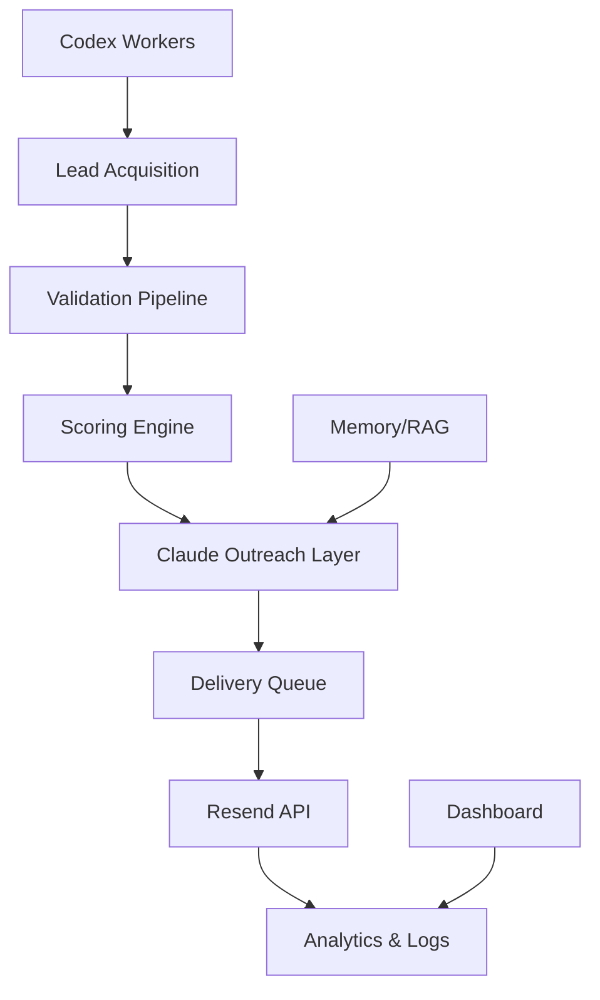

# VRASHOWS AI Runtime

AI-native outbound and event operations platform designed for enterprise event orchestration, lead acquisition, premium outreach, and operational automation.

---

# Overview

VRASHOWS AI Runtime is an orchestration platform combining:

* Claude strategic intelligence
* OpenAI/Codex operational workers
* automated outbound pipelines
* lead acquisition systems
* enterprise email delivery
* AI-assisted event operations

The system was designed to support premium event operations and enterprise outreach workflows while maintaining:

* low operational cost
* controlled token usage
* high deliverability
* scalable orchestration
* modular architecture

---

# Core Architecture



---

# Main Features

## AI-Native Outbound Engine

* enterprise outreach generation
* strategic personalization
* premium HTML email rendering
* PDF attachment workflows
* delivery-safe outbound scheduling

## Lead Acquisition Pipeline

* Futurecom-oriented acquisition
* enterprise event targeting
* scoring and enrichment
* validation queues

## Claude Strategic Layer

Responsible for:

* outreach copy
* executive messaging
* personalization
* brand positioning
* premium communication

## OpenAI/Codex Operational Layer

Responsible for:

* lead acquisition
* enrichment
* validation
* workers
* automation
* scheduling
* parsing pipelines

---

# Delivery System

* Resend integration
* throttled delivery
* batch sending
* safe outbound scheduling
* BCC monitoring
* delivery logging
* retry protection

---

# Cheap Mode Optimization

The runtime was designed with cost governance as a first-class concern.

Features:

* lightweight workers
* queue throttling
* token caps
* cheap routing
* summarized prompts
* modular orchestration
* low-context workers

---

# Dashboard & Observability

Operational monitoring includes:

* outbound metrics
* lead tracking
* delivery status
* token consumption
* queue activity
* worker status
* analytics logs

---

# Security

Sensitive data is never committed.

Protected resources:

* API keys
* logs
* private leads
* customer data
* PDFs
* attachments
* metrics
* usage reports

Environment variables are managed locally via `.env`.

---

# Project Structure

```bash
runtime/
├── agents/
├── workers/
├── scheduler/
├── dashboard/
├── logs/
├── data/
├── docs/
├── prompts/
├── memory/
└── scripts/
```

---

# Automation Flow

```text
Lead Acquisition
↓
Validation
↓
Scoring
↓
Claude Outreach
↓
Approval Layer
↓
Delivery Queue
↓
Resend API
↓
Analytics
```

---

# Current Capabilities

* enterprise lead acquisition
* outbound orchestration
* premium outreach generation
* AI-assisted delivery
* queue management
* operational scheduling
* dashboard observability
* cheap-mode routing
* AI worker orchestration

---

# Planned Evolution

* Redis queues
* distributed workers
* pgvector memory
* Supabase/Postgres
* n8n orchestration
* CRM integrations
* autonomous workflows
* multi-client architecture
* advanced analytics

---

# Development Philosophy

This project prioritizes:

* operational simplicity
* modular AI orchestration
* low-cost execution
* enterprise-grade communication
* scalable automation
* human-in-the-loop validation

---

# Disclaimer

This repository contains a sanitized version of the runtime architecture.

Sensitive operational data, private leads, API credentials, and internal customer information are intentionally excluded.

---

# License

Private / Internal Use

VRASHOWS ©
