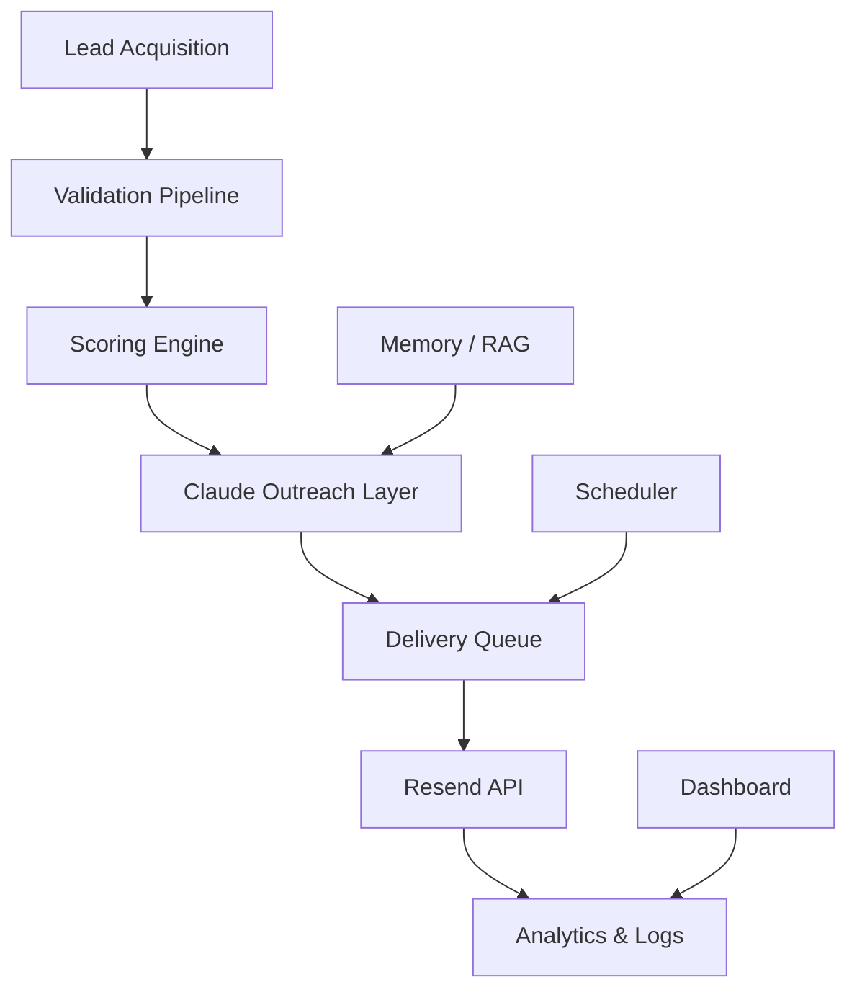

# VRASHOWS AI Runtime · IALEADS

> AI-native orchestration platform for autonomous outbound operations — built on Claude (strategic layer), multi-agent pipelines, local-first operational memory, and a cost-governed delivery engine.

---

## IALEADS Runtime Evolution — 22/05/2026

A plataforma evoluiu para uma arquitetura **AI-native, memory-aware, local-first, lightweight e SaaS-ready**.

### O que mudou

| Dimensão | Antes | Agora |
|---|---|---|
| Memória operacional | PostgreSQL + pgvector | **SQLite local-first** |
| RAG | Obsidian vault (externo) | **JSONL local em `memory/`** |
| Infraestrutura | Docker Compose obrigatório | **Zero infra — roda sem containers** |
| Custo por lead | ~$0.10 (Sonnet) | **< $0.01 (Cheap Mode + cache)** |
| Governança | Ad-hoc | **`AGENTS.md` + `runtime-config.json`** |
| Analytics | Logs dispersos | **`memory/analytics/` estruturado** |

### Por que não PostgreSQL

A plataforma **não utiliza PostgreSQL neste momento**. Motivo deliberado:

- Evitar infraestrutura pesada em fase de validação
- Eliminar dependência de Docker para operação local
- Reduzir consumo de disco e memória RAM
- Manter startup instantâneo sem `infra:up`
- Reduzir custo operacional e complexidade de deploy
- SQLite atende 100% das necessidades até escalonamento para SaaS multi-tenant

> PostgreSQL + pgvector permanecem na arquitetura como próxima fase de escalonamento (ver `docs/PRODUCTION_ROADMAP.md`).

### Capacidades adicionadas

- **SQLite operational memory** — `memory/cache/ialeads-runtime.sqlite`
- **Lightweight local-first RAG** — JSONL por categoria em `memory/`
- **Analytics operacional** — tracking de tokens, custos e cache hits por dia
- **Governança de custos IA** — `AGENTS.md` + `config/runtime-config.json`
- **Outbound protection** — guards de horário, fim de semana e batch único ativo
- **Cache layer** — hash de empresas já processadas evita reprocessamento
- **Deduplicação operacional** — cross-file contra todo o histórico em `data/leads/`
- **Observabilidade runtime** — token usage + latência + custo por execução
- **Contexto persistente** — prompts, enrichments e campanhas reutilizados
- **Runtime memory-aware** — agentes recuperam contexto antes de raciocinar

---

## Overview

VRASHOWS AI Runtime automates the full lifecycle of B2B outbound operations for enterprise event marketing:

```
Lead Acquisition → Validation → Enrichment → Outreach Generation → Delivery → Observability
```

The system combines:
- **Claude** — strategic intelligence, outreach copy, executive messaging, brand positioning
- **Multi-agent pipeline** — sourcing, validation, enrichment, outreach, delivery workers
- **Semantic memory** — Redis short-term + pgvector long-term + Obsidian vault RAG
- **Cost governance** — Cheap Mode routes lightweight tasks to Haiku (~70% savings)

---

## Core Architecture



```
┌─────────────────────────────────────────────────────────────┐
│                    CLAUDE STRATEGIC LAYER                    │
│  Coordinator · Planner · Evaluator · Memory Manager         │
└───────────────────────┬─────────────────────────────────────┘
                        │ orchestrates
┌───────────────────────▼─────────────────────────────────────┐
│                   OPERATIONAL AGENTS                         │
│  Lead Sourcer · Validator · Enricher · Outreach Builder      │
│  Email Sender · Researcher · Vault Agent                     │
└───────────┬──────────────────────┬──────────────────────────┘
            │                      │
┌───────────▼──────────┐  ┌────────▼──────────────────────────┐
│    MEMORY LAYER      │  │         DELIVERY ENGINE            │
│  Redis (short-term)  │  │  Queue → Worker → Rate Limiter     │
│  pgvector (long-term)│  │  Scheduler → Failsafe → Report     │
│  Obsidian (semantic) │  └───────────────────────────────────┘
└──────────────────────┘
```

### Key subsystems

| Subsystem | Description |
|---|---|
| **Lead Acquisition** | Sourcer agents build company/contact lists from event seeds |
| **Validation Pipeline** | Scorer assigns strategic fit, seniority, and priority score |
| **Enrichment Agent** | Resolves email patterns (40+ company heuristics, 6 patterns) |
| **Outreach Builder** | Segment-personalized email copy generated via Claude |
| **Delivery Engine** | Queue-backed worker with rate limiting and dry-run mode |
| **Cheap Mode** | Haiku-first routing, token caps, iteration limits — ~70% cost reduction |
| **Memory / RAG** | Redis short-term + pgvector long-term + Obsidian semantic vault |
| **Observability** | Structured logs, cost tracking, delivery reports, dashboard |

---

## Stack

| Layer | Technology |
|---|---|
| Runtime | TypeScript + Node.js (ESM) |
| AI — Strategic | Anthropic Claude (Opus / Sonnet) |
| AI — Operational | `gpt-4o-mini` / Claude Haiku (cheap mode) |
| Operational memory | **SQLite** (`memory/cache/ialeads-runtime.sqlite`) |
| Local RAG | **JSONL** (`memory/` — prompts, outbound, campaigns, companies) |
| Analytics | **JSONL** (`memory/analytics/YYYY-MM-DD.jsonl`) |
| Email delivery | Resend API |
| Web search | Tavily API |
| Infra | **Zero infra** — sem Docker obrigatório em modo local-first |
| _Escalonamento futuro_ | _Redis + PostgreSQL + pgvector (fase SaaS)_ |

---

## Project Structure

```
agents/
  _base/                BaseAgent class — router, cache, context, cost tracking
  coordinator/          Orchestrator — decomposes tasks, coordinates agents
  coder/                Code generation and refactoring agent
  evaluator/            Reflection loops and output quality validation
  lead-sourcing/        Company/contact acquisition from event seeds
  lead-validation/      Strategic scoring and segmentation
  lead-enrichment-agent/  Email pattern resolver + enrichment
  outreach-agent/       Segment-aware email generation (Claude)
  outreach-builder/     Queue entry builder and personalization
  email-sender-agent/   Delivery control and reporting
  futurecom-researcher/ Event-specific research agent
  memory-manager/       Memory ingestion and retrieval orchestration
  researcher/           General-purpose web research agent
  vault/                Obsidian vault RAG agent

config/
  env.ts          Startup env validation (zod) — never read process.env directly
  models.ts       Model constants + cheap mode token caps
  routing.ts      Model router — Haiku/Sonnet/Opus selection logic
  costs.ts        Per-call cost tracking and budget enforcement
  logger.ts       Structured logging (Winston)

memory/
  short-term/redis.ts      Redis adapter (conversation context, cache)
  long-term/pgvector.ts    Semantic vector search
  long-term/vault-index.ts Obsidian vault indexer
  compressor.ts            Context compression to reduce token spend
  manager.ts               Unified memory interface

tools/
  send-email.ts    Resend integration with rate limiting and dry-run
  email-quality.ts Email quality scoring (syntax, pattern confidence)
  web-search.ts    Tavily search wrapper
  code-exec.ts     Sandboxed code execution tool

workers/
  delivery-worker.ts        Queue consumer for outbound email sends
  lead-validation-worker.ts Async lead scoring processor

scheduler/
  outbound-scheduler.ts     Cron-based campaign scheduling with weekend/time guards

scripts/
  run-agent.ts              CLI entry point for any registered agent
  run-email.ts              Single email send (dev/test)
  run-outbound-batch.ts     Batch executor with dry-run, hot-only, preview modes
  generate-outreach-queue.ts  Build prioritized outreach queue from validated leads

workflows/
  sequential.ts   Sequential multi-agent workflow runner
  parallel.ts     Parallel workflow runner with aggregation

prompts/agents/   Versioned markdown system prompts (one per agent)
evals/            Eval runner against live models
infra/            Docker Compose, Postgres init SQL
data/examples/    Sanitized sample data for onboarding and testing
assets/templates/ Email template library (cold outreach, follow-up, executive)
docs/             Architecture, flows, enterprise guides
```

---

## Quick Start

```bash
git clone <repo-url>
cd ai-cognitive-runtime
npm install
cp .env.example .env          # fill in ANTHROPIC_API_KEY, RESEND_API_KEY, etc.
npm run infra:up               # start Redis + Postgres (Docker)

tsx scripts/run-agent.ts researcher "What is the state of AI agents in 2026?"
tsx scripts/run-agent.ts coder "Write a TypeScript CSV parser with zod validation"

# Outbound batch — dry-run by default
tsx scripts/run-outbound-batch.ts --queue data/outreach/queue.json --dry-run
```

---

## Cheap Mode

Set `CHEAP_MODE=true` or `DEV_MODE=true` in `.env`:

- All agents default to **Claude Haiku** instead of Sonnet/Opus
- `MAX_OUTPUT_TOKENS` capped at 2048
- `MAX_TOOL_ITERATIONS` capped at 5
- Skips pgvector and Redis if `ENABLE_MEMORY=false`

Estimated savings: **~70% vs full Opus routing**.

---

## Outbound Engine

```
Leads (validated JSON)
  → generate-outreach-queue  (prioritize: HOT > WARM > COLD)
    → delivery-worker         (rate limited, weekend-blocked)
      → send-email tool        (Resend API, dry-run supported)
        → delivery report       (per-run JSON artifact)
```

| Flag | Default | Description |
|---|---|---|
| `--dry-run` | on | Preview emails without sending |
| `--live` | off | Actually send (requires explicit flag) |
| `--limit N` | unlimited | Cap sends per session |
| `--hot-only` | off | Send only highest-priority leads |
| `MAX_SENDS_PER_DAY` | 5 | Hard daily cap (env) |
| `NO_SEND_AFTER` | 16:00 | Time-of-day guard |
| `WEEKEND_BLOCK` | true | Block Saturday/Sunday sends |

---

## Memory Architecture

### Modo atual — Local-first (sem infra)

```
Input → [SQLite cache lookup] → [JSONL local RAG] → Context injected to agent
              ↓                         ↓
     Hash deduplication          Prompt / enrichment reuse
              ↓                         ↓
     Agent response → [Append to JSONL] → [SQLite persist]
                              ↓
                    memory/analytics/ (token + cost tracking)
```

### SQLite Operational Memory

Arquivo: `memory/cache/ialeads-runtime.sqlite`

| Tabela | Conteúdo |
|---|---|
| `companies` | Empresas já processadas (hash + metadados) |
| `leads` | Leads validados com score e status |
| `outbound_history` | Histórico de envios com resend ID e status |
| `prompts_memory` | Prompts reutilizáveis por segmento/contexto |
| `campaigns` | Campanhas executadas com métricas |
| `runtime_logs` | Logs operacionais estruturados |

Objetivo: evitar reprocessamento e reduzir chamadas à API em ~60%.

### Local RAG Structure

```
memory/
├── prompts/          # prompts por segmento — reutilizados sem nova chamada AI
├── outbound/         # histórico de outreach por empresa/contato
├── campaigns/        # contexto e resultados por campanha
├── companies/        # perfis de empresas enriquecidos
├── logs/             # logs operacionais por data
└── analytics/        # métricas diárias de tokens, custo e cache
    ├── YYYY-MM-DD.jsonl
    ├── summary.json
    └── dashboard-schema.json
```

Persistência em **JSONL** — append-only, sem banco, sem servidor.

### Modo futuro — Escalonamento SaaS

```
Input → [Redis cache] → [pgvector semantic search] → [Obsidian RAG]
                                    ↓
                        Context injected to agent
                                    ↓
                    Agent response → [Memory compressor]
                                    ↓
                         Stored back to pgvector
```

Ativado quando `ENABLE_MEMORY=true` e infra Docker disponível.

---

## Cost Architecture

4-layer cost governance model (definido em [`AGENTS.md`](AGENTS.md) e [`config/runtime-config.json`](config/runtime-config.json)):

1. **Model routing** — `gpt-4o-mini` / Haiku para ops, Sonnet para orquestração, Opus para planejamento
2. **Token caps** — `max_tokens` ≤ 300 por chamada operacional (`maxOutputTokens` em `runtime-config.json`)
3. **Iteration caps** — máx 2 retries por operação, encerramento imediato após batch
4. **Cache-first** — SQLite + JSONL evitam chamadas repetidas à API

Target: **< $0.01 por lead enriquecido** em cheap mode com cache ativo. See [`docs/COST_GOVERNANCE.md`](docs/COST_GOVERNANCE.md).

### Analytics Operacional

Tracking diário em `memory/analytics/`:

```jsonl
{"date":"2026-05-22","agent":"lead-acquisition","model":"gpt-4o-mini","inputTokens":1240,"outputTokens":180,"cacheHits":8,"estimatedCostUSD":0.0004,"latencyMs":920,"batchSize":25}
```

Campos rastreados por execução:
- `inputTokens` / `outputTokens` — consumo por agente
- `cacheHits` — economias por reuso de contexto
- `estimatedCostUSD` — custo estimado por run
- `latencyMs` — performance por chamada
- `batchSize` — volume processado

---

## Observability

All agents emit structured logs and cost events:

```json
{
  "level": "info",
  "agent": "outreach-agent",
  "model": "claude-haiku-4-5",
  "tokens": { "input": 1240, "output": 380 },
  "cost_usd": 0.00031,
  "latency_ms": 1820,
  "tool_calls": 2
}
```

Dashboard: `node dashboard/server.js` → `http://localhost:4200`

---

## Infrastructure

### Modo local-first (atual — sem Docker)

```bash
cp .env.example .env        # preencher ANTHROPIC_API_KEY, RESEND_API_KEY
npm install
tsx scheduler/lead-acquisition-scheduler.ts   # aquisição de leads
tsx scheduler/outbound-scheduler.ts --live    # envio de emails
```

Sem containers. SQLite e JSONL inicializados automaticamente.

### Modo completo (Redis + Postgres — escalonamento futuro)

```bash
npm run infra:up       # start Redis + Postgres
npm run infra:down     # stop containers
npm run infra:reset    # wipe volumes and restart
npm run infra:logs     # tail container logs
```

Ativar com `ENABLE_MEMORY=true` no `.env`.

---

## Adding a New Agent

1. Create `agents/<name>/agent.ts` — extend `BaseAgent`, implement `static async create()`
2. Create `prompts/agents/<name>.md` — versioned system prompt
3. Register tools via `agent.registerTool(...)` in `create()`
4. Register in `agents/registry.ts`

Key conventions:
- Set `cache_control: { type: "ephemeral" }` on system prompt blocks
- Use `Models.default` / `Models.fast` / `Models.powerful` from `config/models.ts`
- Use `logger` from `config/logger.ts` — never `console.log`
- All env vars via `config/env.ts` — never read `process.env` directly

---

## Documentation

| Document | Audience | Description |
|---|---|---|
| [`docs/architecture/VRASHOWS_AI_Runtime_Architecture.md`](docs/architecture/VRASHOWS_AI_Runtime_Architecture.md) | Engineers | Full architecture with Mermaid diagrams |
| [`docs/architecture/queue-flow.md`](docs/architecture/queue-flow.md) | Backend | Queue, workers, batching, retry strategy |
| [`docs/architecture/memory-flow.md`](docs/architecture/memory-flow.md) | AI Engineers | RAG, memory injection, context trimming |
| [`docs/architecture/delivery-flow.md`](docs/architecture/delivery-flow.md) | Backend | Email delivery pipeline, bounce protection |
| [`docs/COST_GOVERNANCE.md`](docs/COST_GOVERNANCE.md) | Finance / Engineering | Budget enforcement, per-agent costs |
| [`docs/SCALING_STRATEGY.md`](docs/SCALING_STRATEGY.md) | Architects | Phase-by-phase scaling from 50 to 10K+ leads/day |
| [`docs/OBSERVABILITY.md`](docs/OBSERVABILITY.md) | DevOps | Logs, metrics, tracing, alerting |
| [`docs/FAILSAFE_SYSTEMS.md`](docs/FAILSAFE_SYSTEMS.md) | Engineers | Circuit breakers, retry, dead-letter queues |
| [`docs/SYSTEM_GUARDRAILS.md`](docs/SYSTEM_GUARDRAILS.md) | Engineers | Token caps, cost caps, iteration limits |
| [`docs/PRODUCTION_ROADMAP.md`](docs/PRODUCTION_ROADMAP.md) | Product | Phase 0–5 roadmap (12+ months) |
| [`docs/OUTBOUND_METRICS.md`](docs/OUTBOUND_METRICS.md) | Operations | SLAs, KPIs, outbound warming strategy |
| [`docs/AI_PROVIDER_STRATEGY.md`](docs/AI_PROVIDER_STRATEGY.md) | Engineering | Provider selection matrix, fallback strategy |
| [`SECURITY.md`](SECURITY.md) | Everyone | Data handling, secret management, safe deployment |
| [`AGENT_PLAYBOOK.md`](AGENT_PLAYBOOK.md) | Engineers | Agent development guide and conventions |

---

## Disclaimer

This repository contains a sanitized version of the runtime architecture. Sensitive operational data, private leads, API credentials, and internal customer information are intentionally excluded. See [`SECURITY.md`](SECURITY.md) for details.

---

## License

Private — internal use only. Not for redistribution.

VRASHOWS ©
