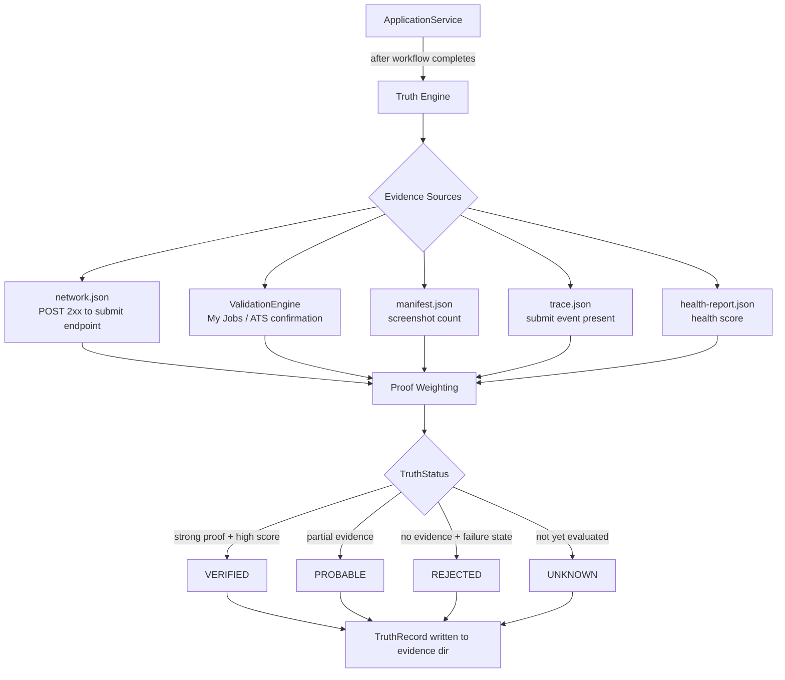

# ADR-002: Truth Engine — Evidence-Based Application Verification

**Status:** Accepted  
**Date:** 2026  
**Context:** VRAXIA WORK — Autonomous LinkedIn Application System

---

## Problem

Autonomous job application systems face a fundamental observability problem: **how do you know the application was actually submitted?**

The browser can navigate, click Submit, and reach a success state — but the network request might have failed silently, the platform might have shown a generic confirmation page without actually recording the application, or a transient error could have interrupted the process without surfacing an exception.

Relying on workflow state alone (`confirmed`, `submitted`) is insufficient. A robot that believes it has applied when it hasn't is worse than one that fails loudly — it produces silent false positives in the application log.

---

## Decision

Implement a dedicated **Truth Engine** that evaluates objective, multi-source evidence after each application attempt and produces a `TruthRecord` — a structured verdict independent from workflow state.

The Truth Engine runs *after* the workflow completes, reading physical evidence from disk and network captures rather than trusting in-memory state.

---

## Architecture

---

## Evidence Hierarchy

Evidence sources are weighted by reliability. Network-level proof (an HTTP 2xx response to the platform's submit endpoint) is the strongest possible evidence — it means the server accepted the request. Platform-side confirmation (the job appearing in "My Jobs > Applied") is independently verifiable. Visual evidence (screenshots, page text) is weaker but contributes when stronger evidence is absent.

The system distinguishes between **hard proofs** — evidence that alone is sufficient to declare VERIFIED — and **soft proofs** that accumulate toward a confidence score.

---

## Key Design Decisions

**Evidence is read from disk, not from memory.** The Truth Engine treats itself as an external auditor. It reads `network.json`, `trace.json`, and `manifest.json` from the evidence directory — artifacts written during the apply flow by independent subsystems. This means the Truth Engine can be re-run post-hoc on any historical application.

**TruthStatus is never inferred from ApplicationState.** The workflow completing successfully (`confirmed`) does not imply `VERIFIED`. A robot can reach `confirmed` while the submit request failed silently. Conversely, a `failed` workflow might have submitted before the error occurred.

**The Truth Engine is a read-only auditor.** It does not alter workflow state, does not retry, and does not interact with the browser. Its sole output is a `TruthRecord`.

---

## Outcomes

- False positives in the application log dropped to near zero
- Applications can be re-audited at any time from the evidence directory
- Dashboard displays Truth status independently from workflow status
- The distinction between "robot said it applied" and "there is evidence it applied" is surfaced explicitly to the user

---

## Related

- [ADR-001: Architecture](./ADR-001-architecture.md)
- [Application State Machine](./ADR-003-state-machine.md) (see below)
