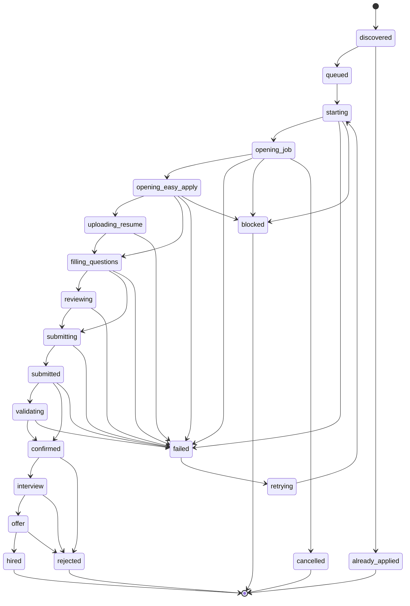

# ADR-003: Application State Machine

**Status:** Accepted  
**Date:** 2026  
**Context:** VRAXIA WORK — Autonomous LinkedIn Application System

---

## Problem

Autonomous multi-step processes need explicit state management. Without a formal state machine, error handling becomes ad-hoc, retries are unpredictable, and observability is impossible — you can't answer "what was the robot doing when it failed?"

---

## Decision

Model every job application as a finite state machine with explicitly defined states, terminal states, and controlled transitions. The state machine rejects invalid transitions at the type level, making illegal states unrepresentable.

---

## State Diagram

---

## State Categories

**Pre-apply:** `discovered`, `queued`, `already_applied` — job found, deduplication check, queued for processing.

**Apply flow:** `starting` → `opening_job` → `opening_easy_apply` → `uploading_resume` → `filling_questions` → `reviewing` → `submitting` → `submitted` → `validating` → `confirmed` — the complete autonomous apply sequence.

**Terminal (apply):** `confirmed`, `failed`, `cancelled`, `blocked`, `already_applied`, `rejected`, `hired` — no further transitions except retry paths.

**Career lifecycle:** `rejected`, `interview`, `offer`, `hired` — post-apply states updated manually or via integrations.

---

## Key Design Decisions

**Transitions are enforced at runtime.** The state machine rejects any transition not defined in the topology with an explicit error. This prevents the apply engine from skipping states or entering invalid sequences under error conditions.

**Separate workflow state from truth status.** `confirmed` means the robot completed the workflow, not that the application was verified. See [ADR-002](./ADR-002-truth-engine.md) for how evidence-based verification handles this distinction.

**Retry paths are explicit states.** `failed → retrying → starting` is a first-class path, not an implicit behavior. This makes retry logic observable and limits the maximum retry count at the state machine level.

**Career lifecycle extends the same machine.** Rather than a separate system for tracking post-apply status, `rejected`, `interview`, `offer`, `hired` extend the same state type. This allows unified querying across the full application lifecycle.

---

## Related

- [ADR-001: Architecture](./ADR-001-architecture.md)
- [ADR-002: Truth Engine](./ADR-002-truth-engine.md)
