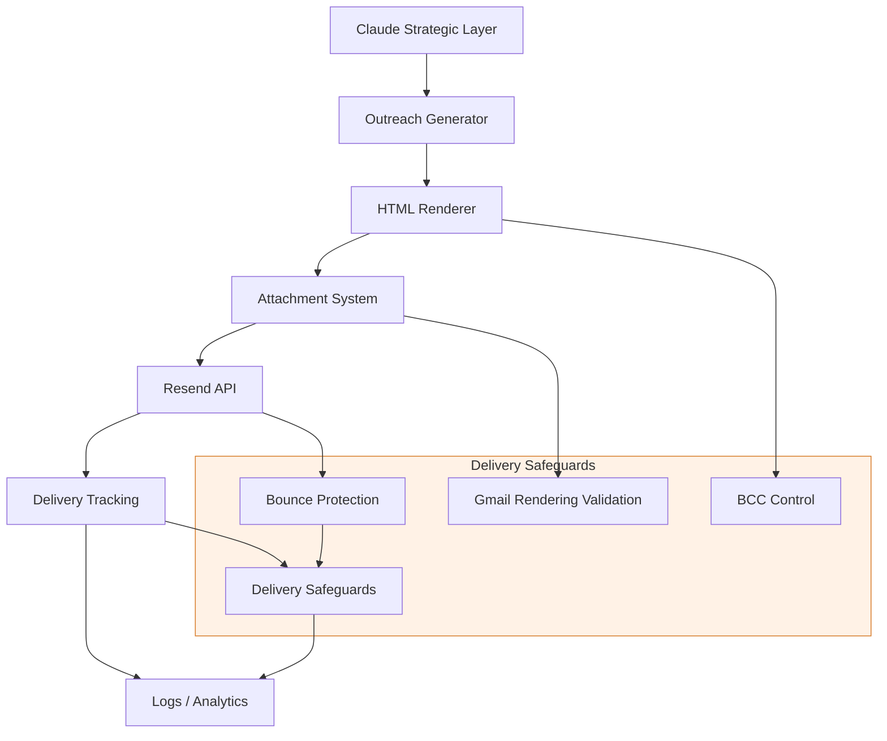

# VRASHOWS Delivery Flow

## Objetivo

Documentar o fluxo de entrega do runtime AI VRASHOWS com foco em email, attachments, entrega e tracking.

## Delivery pipeline diagram

## Delivery flow

- **Claude Strategic Layer**: elabora o posicionamento e a abordagem de outreach.
- **Outreach Generator**: monta subject, email body e CTA.
- **HTML Renderer**: aplica o template VRASHOWS e gera HTML compatível.
- **Attachment System**: resolve e inclui o PDF institucional no envio.
- **Resend API**: dispara o email transacional.
- **Delivery Tracking**: captura resultado, status e IDs de entrega.
- **Logs / Analytics**: centraliza métricas de entrega e falhas.

## BCC control

- O sistema usa `OUTBOUND_BCC_EMAIL` configurável.
- BCC pode ser suprimido por envio específico.
- O envio é rastreado e logado para auditoria.

## PDF attachment flow

- O `send_email` tool valida `attachmentPath` antes do envio.
- Arquivos faltantes resultam em falha controlada, não em crash.
- O PDF institucional é anexado automaticamente para cold outreach.

## Gmail rendering validation

- O HTML é construído com blocos simples e um template responsivo.
- A arquitetura presume validação manual de templates críticos.
- Em produção, recomenda-se test suite de renderização de email.

## Bounce protection

- Deduplicação de destinatários é controlada por Redis.
- Cada envio registra a chave `email:sent:<recipient>` com TTL.
- Emails duplicados são skipados dentro da janela configurada.

## Delivery safeguards

- Rate limiting interno protege contra limites do Resend.
- Erros do Resend são capturados e retornam status `failed`.
- Dry-run mode permite ensaios sem envio real.

## Operational recommendations

- Adotar um worker pool dedicado para o delivery loop.
- Adicionar métricas de entrega por minuto, sucesso/falha e latency.
- Manter o attachment path centralizado e versionado.
- Sincronizar com QA de email para renderização Gmail/Outlook.
