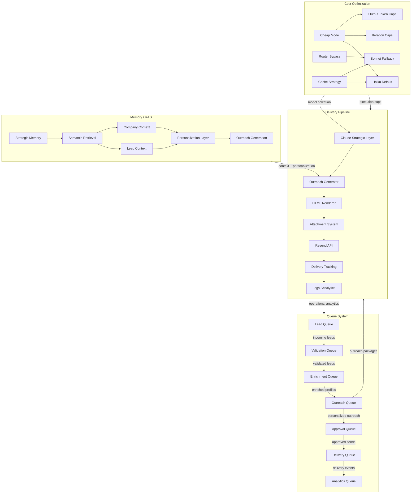

# VRASHOWS AI Runtime — Diagram Summary

## Purpose

Documento de referência visual para o runtime AI da VRASHOWS, com foco em:
- Queue System
- Delivery Pipeline
- Memory / RAG Architecture
- Cost Optimization Layer

Este material é projetado para onboarding enterprise, revisão arquitetural e planejamento de escala.

## Mermaid diagram

## Simplified architecture map

- **Queue System**
  - Lead Queue → Validation Queue → Enrichment Queue → Outreach Queue → Approval Queue → Delivery Queue → Analytics Queue
  - Prioridade declarativa: HOT > WARM > NORMAL
  - Fail-safe: filas batched em JSON e reprocessáveis em caso de interrupção
  - Concurrency limits aplicados em workers de batch

- **Delivery Pipeline**
  - Claude strategic layer alimenta o outreach generator
  - HTML renderer compõe conteúdo com template VRASHOWS
  - Attachment system anexa mídia kit PDF
  - Resend API entrega email e retorna tracking
  - Delivery tracking grava status em logs e Redis

- **Memory / RAG**
  - Strategic Memory (Postgres+pgvector) alimenta recuperação semântica
  - Redis short-term serve de cache e dedup
  - Company Context e Lead Context são injetados em prompt
  - Personalization Layer transforma contexto em mensagens hiper-personalizadas

- **Cost Optimization**
  - `CHEAP_MODE` reduz tokens, iterações e força modelos `fast`
  - Roteador de modelo escolhe entre Haiku, Sonnet e fallback automático
  - Cache de resposta e embeddings evita chamadas redundantes

## Operational explanation

### Queue System

O runtime usa uma cadeia de filas que refletem o ciclo de vida do lead. Cada etapa é tratada como um domínio separado:
1. **Lead Queue**: entrada de leads brutos ou seed list.
2. **Validation Queue**: valida leads, classifica risco e prioridade.
3. **Enrichment Queue**: adiciona contatos e dados de e-mail.
4. **Outreach Queue**: monta conteúdo e cria a fila de envio.
5. **Approval Queue**: garante revisão humana ou regras de qualidade antes do envio.
6. **Delivery Queue**: processa envios controlados.
7. **Analytics Queue**: coleta métricas de entrega e performance.

Cada queue deve ser tratada por workers distintos que podem reprocessar arquivos JSON ou filas persistentes.

### Delivery Pipeline

O fluxo de entrega é um caminho unidirecional de conteúdo até a caixa de saída:
- **Claude Strategic Layer** decide posicionamento e ajustes de mensagem.
- **Outreach Generator** cria subject, body e CTA.
- **HTML Renderer** aplica template VRASHOWS e prepara bodyHtml.
- **Attachment System** resolve e anexa o PDF institucional.
- **Resend API** realiza a entrega do e-mail.
- **Delivery Tracking** captura status, falhas e IDs de envio.
- **Logs / Analytics** registram cada etapa para operações e governança.

### Memory / RAG

A arquitetura de memória é triádica:
- **Strategic Memory**: memórias rankeadas e priorizadas em Postgres+pgvector.
- **Semantic Retrieval**: busca semântica recupera contexto relevante para prompts.
- **Context Management**: apenas o contexto selecionado é injetado para conter tokens.

O fluxo de memória garante que o outreach receba:
- contexto de empresa
- contexto de lead
- histórico relevante de runs anteriores
- scoring por relevância para personalização

## Bottleneck analysis

### Queue System
- Arquivos JSON como fila são simples, mas limitam o paralelo e a resiliência.
- Sem broker real, retry strategy depende de reexecução manual.
- Concurrency e throttling são controlados no código do batch worker.

### Delivery Pipeline
- Resend API e attachments são o maior ponto de falha.
- Email HTML + PDF frames exigem validação de renderização (Gmail / Outlook).
- Dedup e bounce protection dependem de Redis; falhas no Redis reduzem a segurança.

### Memory / RAG
- Postgres+pgvector escala bem, mas precisa de tuning de índices para grandes vaults.
- Token trimming e compressão de contexto são essenciais para evitar prompt overflow.
- Retrieval seletivo diminui o custo, mas pode perder sinal se mal configurado.

### Cost Optimization
- Cheap mode é vital para ambientes de desenvolvimento e demo.
- Mesmo em produção, modelo automático deve ser monitorado para evitar bursts de Sonnet.
- Cache de resposta/embeddings reduz custo, mas exige Redis estável.

## Scaling recommendations

- Introduzir um **broker de filas** (Redis Streams, SQS, Kafka) para substituir JSON batch.
- Separar workers em microsserviços:
  - lead intake
  - validation worker
  - enrichment worker
  - outreach generator
  - delivery worker
  - analytics worker
- Usar **backpressure** no delivery worker para respeitar limites do Resend.
- Converter o **Approval Queue** em polí­ticas de gating com falhas automáticas e exceções auditáveis.
- Externalizar a **Memory / RAG service** como um serviço de consulta semântica dedicado.
- Adicionar **telemetria** de custo, latência e taxa de entrega para cada fila.

## Arquitetura preparada para n8n / workers futuros

- O modelo de filas e workers é compatível com orquestradores externos.
- A separação entre geração de conteúdo, validação e entrega permite transformar scripts em nodes n8n.
- A camada de memória pode ser exposta como serviço de contexto para qualquer worker.
- A política de cheap mode e roteamento de modelo mantém o runtime pronto para ambientes multi-tenant.
