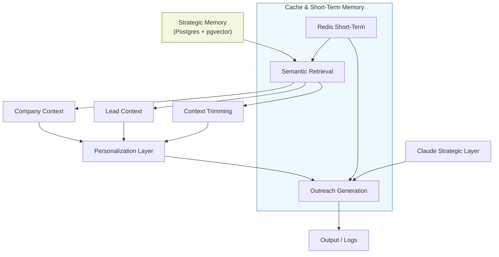

# VRASHOWS Memory / RAG Flow

## Objetivo

Visualizar a arquitetura de memória e recuperação semântica do runtime AI VRASHOWS.

## Memory / RAG diagram

## Core flow

1. **Strategic Memory** guarda memórias semânticas e histórico de runs em PostgreSQL + pgvector.
2. **Semantic Retrieval** busca informações relevantes para o lead e a empresa.
3. **Company Context** devolve dados de domínio, posicionamento e marca.
4. **Lead Context** devolve dados de contato, senioridade e histórico.
5. **Personalization Layer** combina sinais para gerar mensagem personalizada.
6. **Outreach Generation** produz conteúdo final para envio.

## Selective retrieval

- Apenas contexto relevante é injetado nos prompts.
- Recuperação é baseada em similaridade e em limites de score.
- O objetivo é equilibrar relevância com custo de token.

## Summarized memory injection

- Memórias são formatadas como blocos curtos antes de entrar no prompt.
- O sistema inclui títulos, tipo de memória e importância.
- A injeção é resumida para evitar overload de contexto.

## Context trimming

- Se o contexto excede limites de token, o runtime comprime automaticamente.
- O `BaseAgent` avalia o tamanho e chama compressão para reduzir o payload.
- Isso mantém o prompt dentro do `contextTokenLimit` sem perder sinal importante.

## Relevance scoring

- A arquitetura usa pontuação de relevância para priorizar:
  - empresas de maior fit
  - contatos de alta senioridade
  - leads com menor risco de bounce
- Essa pontuação alimenta a fila de outreach.

## Low-token strategy

- `CHEAP_MODE` limita context injection e model size.
- O roteador seleciona `Models.fast` ou `Models.default` conforme custo.
- Cache de embeddings reduz repetição de consultas semânticas.

## Production considerations

- Externalizar o retrieval como serviço reduz acoplamento.
- Implementar cache de resultados de recuperação para consultas frequentes.
- Monitorar qualidade de RAG para evitar injeção de contexto irrelevante.
