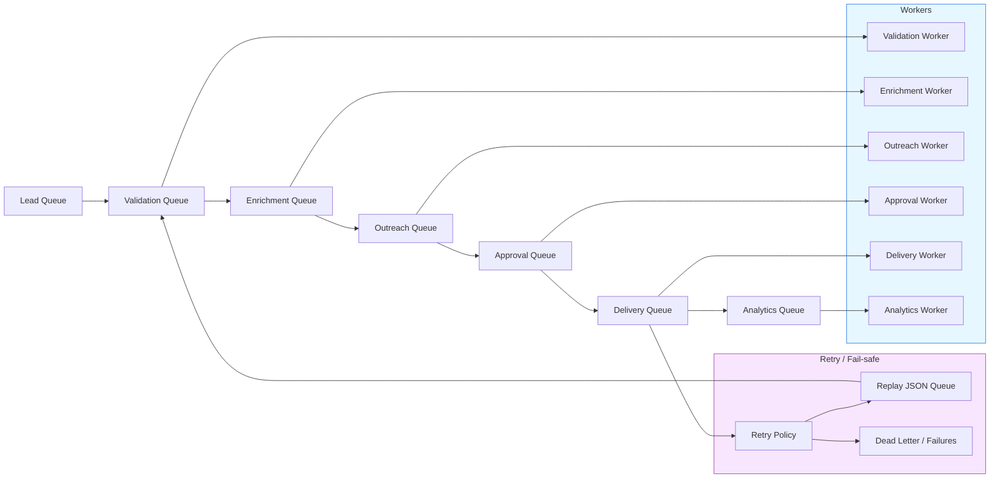

# VRASHOWS Queue Flow

## Objetivo

Documento visual de fluxo para a arquitetura de filas do runtime AI VRASHOWS.

## Queue architecture diagram

## Key concepts

- **Lead Queue**: entrada inicial de leads brutos, seed data ou descoberta LLM.
- **Validation Queue**: valida leads e classifica risco/prioridade.
- **Enrichment Queue**: adiciona contatos, cargos e emails prováveis.
- **Outreach Queue**: converte leads validados em pacotes de outreach.
- **Approval Queue**: camada de revisão e regras de qualidade antes do send.
- **Delivery Queue**: envios reais controlados com throttling.
- **Analytics Queue**: eventos de entrega, métricas e relatórios.

## Fail-safe behavior

- Filas são materializadas em JSON estável (`data/outreach/*.json`).
- Erros de workers resultam em retry manual ou replay automático da fila.
- Delivery failures podem ser movidos para dead-letter e analisados.

## Concurrency and throttling

- Cada worker é separado, permitindo escalonamento independente.
- Delivery worker aplica throttling de taxa (`--rate-delay`) para respeitar Resend.
- Prioridade HOT/WARM define ordem de processamento em `run-outbound-batch.ts`.
- Concurrency limits são implementados no código dos workers e no orquestrador.

## Queue priorities

- HOT leads são processados antes de WARM e LOW_PRIORITY.
- A prioridade é mantida na fila de outreach e no delivery executor.
- Análise de qualidade bloqueia leads abaixo de threshold.

## Worker separation

- A separação por domínio reduz acoplamento e facilita manutenção.
- Cada etapa pode migrar para um worker n8n/queue service sem mudanças lógicas profundas.

## Recommended production improvements

- Migrar para broker real (Redis Streams / SQS / Kafka).
- Implementar dead-letter para entrega e validação.
- Monitorar latência e taxa de retry por fila.
