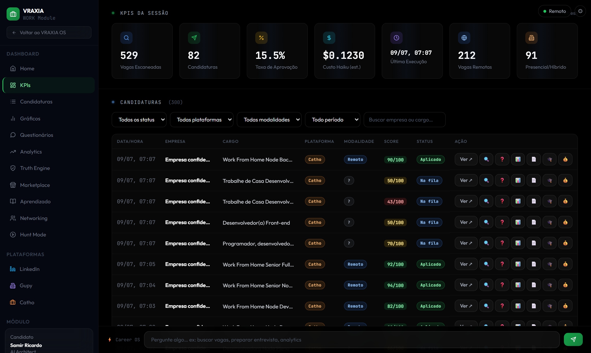
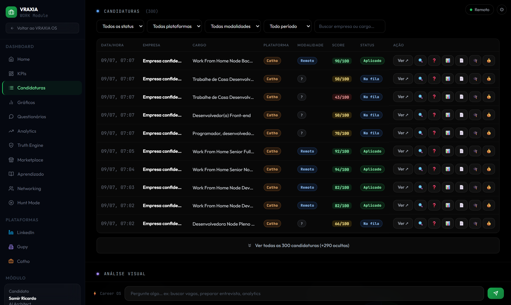
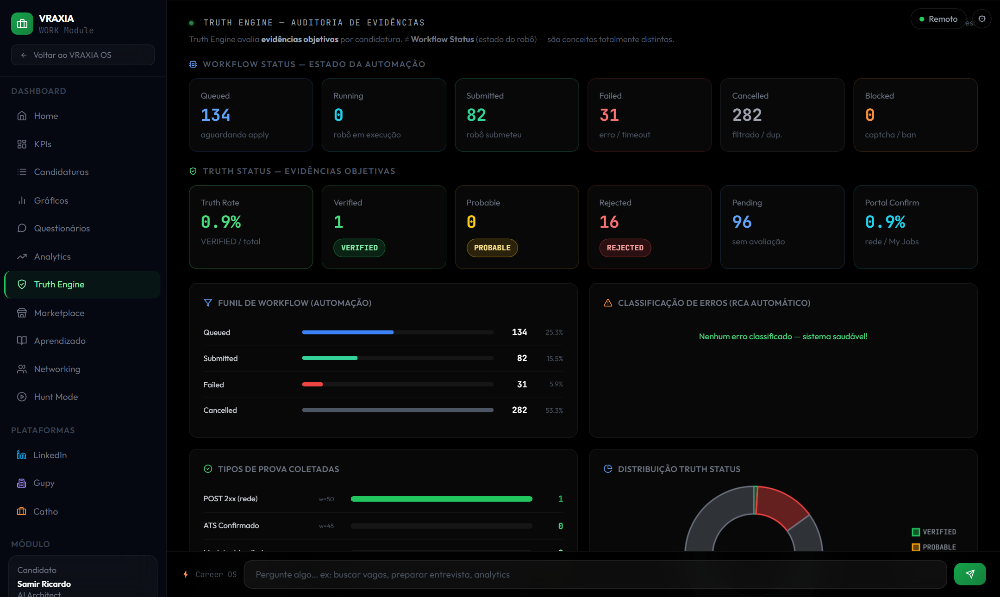
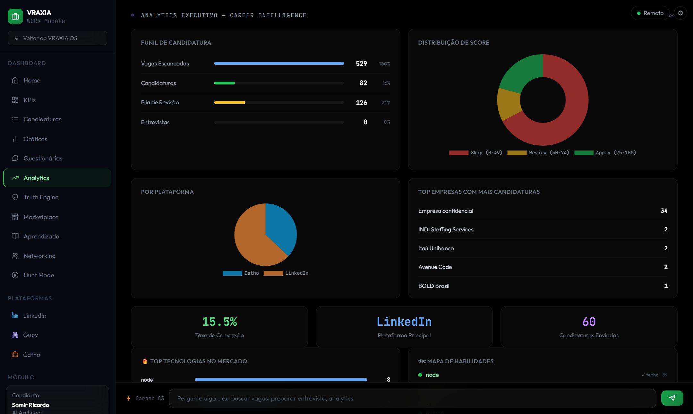
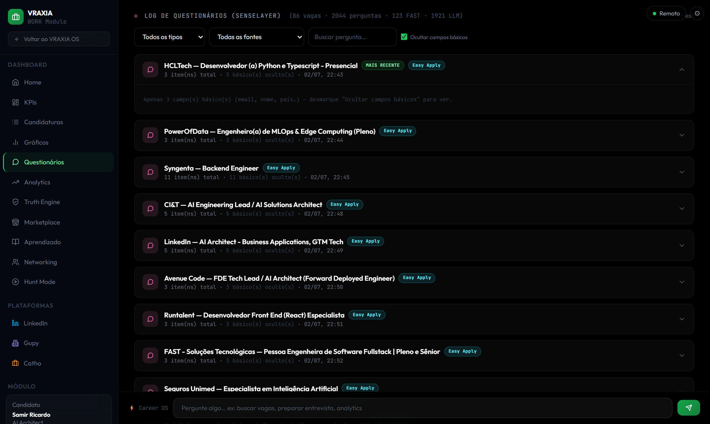
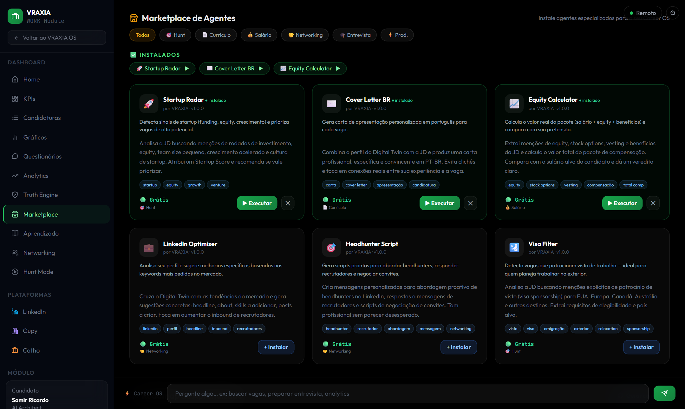

# VRAXIA WORK — Autonomous Job Hunt OS

> Sistema autônomo de busca e candidatura a vagas com orquestração multi-agente, validação por evidências e analytics em tempo real.

**Stack:** TypeScript · Node.js · Playwright · Anthropic Claude · SQL.js · Express · TF-IDF RAG · Telegram

**Deploy:** [vraxia-platform.vercel.app](https://vraxia-platform.vercel.app) &nbsp;|&nbsp; API local na porta `3001`

---

## O que é

VRAXIA WORK é um runtime de automação de carreira que:

1. **Encontra vagas** no LinkedIn, Gupy e Catho usando filtros heurísticos + scoring LLM
2. **Pontua e filtra** cada vaga com um agente especializado (score 0–25, threshold configurável)
3. **Candidata automaticamente** via Playwright com anti-detection, upload de CV e preenchimento inteligente de questionários
4. **Valida objetivamente** se a candidatura foi enviada usando múltiplas fontes de evidência (network, UI, histórico)
5. **Expõe um dashboard** completo com analytics, funil de workflow, Truth Engine e auditoria por candidatura

O sistema é projetado para rodar de forma autônoma: um agendador dispara o hunt em janela aleatória diária, envia relatório no Telegram e ajusta o comportamento conforme padrões históricos detectados.

---

## Arquitetura

```
┌─────────────────────────────────────────────────────────────────────┐
│                         VRAXIA WORK                                  │
│                                                                       │
│  CLI / Scheduler                                                      │
│  ┌──────────────┐   ┌──────────────┐   ┌─────────────────────────┐  │
│  │   hunt.ts    │   │ scheduler.ts │   │    Telegram notify      │  │
│  └──────┬───────┘   └──────┬───────┘   └─────────────────────────┘  │
│         │                  │                                          │
│         ▼                  ▼                                          │
│  ┌──────────────────────────────────────────────────────────────┐    │
│  │                  ApplicationService                          │    │
│  │  JobFilterAgent → LinkedInApplyEngine → ValidationEngine     │    │
│  │                         ↓                                    │    │
│  │               ApplicationTruthEngine                         │    │
│  └──────────────────────────────────────────────────────────────┘    │
│                             │                                         │
│         ┌───────────────────┼───────────────────┐                    │
│         ▼                   ▼                   ▼                    │
│  ┌─────────────┐   ┌──────────────┐   ┌──────────────────┐          │
│  │  SQLite DB  │   │ EvidenceDir  │   │  CareerMemory DB │          │
│  │  work.db    │   │ screenshots/ │   │  career-mem.db   │          │
│  └─────────────┘   │ network.json │   └──────────────────┘          │
│                    │ trace.json   │                                   │
│                    │ truth-record │                                   │
│                    └──────────────┘                                   │
│                                                                       │
│  API Express :3001                                                    │
│  ┌────────────────────────────────────────────────────────────┐      │
│  │  /api/work/applications  /truth-stats  /workflow-stats     │      │
│  │  /api/work/evidence/:id  /analytics    /chat               │      │
│  └────────────────────────────────────────────────────────────┘      │
│                             │                                         │
│                     ┌───────▼────────┐                               │
│                     │  Dashboard SPA  │                              │
│                     │  (Vercel/local) │                              │
│                     └────────────────┘                               │
└─────────────────────────────────────────────────────────────────────┘
```

---

## Módulos principais

### Agentes cognitivos (`src/agents/`)

Cada agente é um especialista LLM isolado com contexto mínimo e custo controlado.

| Agente | Modelo | Responsabilidade |
|---|---|---|
| `JobFilterAgent` | Sonnet | Score de compatibilidade por vaga (0–25). Threshold 18 = APPLY |
| `QuestionnaireAgent` | Haiku | Responde questões de candidatura via RAG em 5 camadas |
| `ResumeAgent` | Sonnet | Adapta currículo para cada empresa/vaga |
| `ATSAgent` | Sonnet | Analisa compatibilidade ATS: keywords presentes vs. ausentes |
| `InterviewCoach` | Sonnet | Gera perguntas prováveis + respostas modelo por empresa |
| `SalaryAdvisor` | Sonnet | Benchmarking de remuneração com script de negociação |
| `LearningAgent` | Sonnet | Mapeia skill gaps com base nas vagas analisadas |
| `NetworkingAgent` | Sonnet | Estratégias de networking e scripts de conexão |
| `StatusTracker` | Haiku | Extrai status de candidatura a partir de screenshots |

**Hierarquia de custo:** Haiku para extração rápida → Sonnet para raciocínio → TF-IDF para retrieval (custo zero).

---

### Automação browser (`src/engine/`)

| Módulo | Detalhe |
|---|---|
| `LinkedInSession` | Gerencia cookies, detecção de expiração, renew automático |
| `JobSearchEngine` | Navega LinkedIn Jobs com filtros, extrai 50–100 vagas por rodada |
| `EasyApplyEngine` | Clica Easy Apply, preenche questões, faz upload de CV, submete |
| `GupySearchEngine / ApplyEngine` | Suporte completo à plataforma Gupy |
| `CathoSearchEngine / ApplyEngine` | Suporte completo à plataforma Catho |
| `GreenhouseApplyEngine` | Candidatura via ATS Greenhouse externo |
| `ModalityDetector` | Filtro geográfico CPU-only: REMOTO / HÍBRIDO / PRESENCIAL |

**Anti-detection:** user-agent rotation, human delays aleatórios, Playwright stealth plugin, detecção de ban signal com cooldown obrigatório.

---

### State machine de candidatura (`src/application/`)

Cada candidatura percorre um ciclo de vida estritamente tipado:

```
discovered → queued → starting → opening_job → opening_easy_apply
  → uploading_resume → filling_questions → reviewing → submitting
  → submitted → validating → confirmed | failed | blocked | timeout
```

Estados pós-apply (atualizados via dashboard):
```
confirmed → interview → offer → hired
         → rejected
```

Transições inválidas são rejeitadas em tempo de execução. Retries com backoff exponencial para estados recuperáveis.

---

### Truth Engine (`src/application/ApplicationTruthEngine.ts`)

O componente mais crítico do sistema. Avalia **objetivamente** se uma candidatura foi enviada, independente do que a UI reportou.

**Por que existe:** automações podem terminar com sucesso no workflow mas a candidatura não ter sido registrada (sessão expirada, erro silencioso de rede, redirect falso). O Truth Engine coleta provas físicas.

**7 tipos de prova com pesos calibrados:**

| Prova | Peso | Descrição |
|---|---|---|
| `network_submit_200` | **80** | POST para endpoint apply retornou HTTP 2xx |
| `ats_confirmation` | 75 | ATS externo (Greenhouse, Workday) confirmou |
| `my_jobs_applied` | 70 | Vaga aparece em My Jobs > Applied no LinkedIn |
| `confirmation_text` | 45 | Texto "candidatura enviada" detectado na página |
| `url_redirect` | 35 | Redirect para URL pós-apply |
| `health_check_passed` | 20 | Health score do browser ≥ 80/100 |
| `screenshot_exists` | 10 | Evidência visual capturada |
| `trace_complete` | 10 | trace.json contém evento de submit |

**Classificação:**
```
score ≥ 80 + hard proof (rede/MyJobs/ATS) → VERIFIED
score ≥ 40                                 → PROBABLE
estado de falha explícito no workflow      → REJECTED
sem evidência suficiente                   → UNKNOWN
```

**Separação clara de mundos:**
- `ApplicationState` = estado do robô (o que a automação fez)
- `TruthStatus` = evidência objetiva (o que realmente aconteceu)

Estes dois valores nunca se misturam nas métricas do dashboard.

---

### RAG em 5 camadas (`src/rag/`)

O `QuestionnaireAgent` usa um pipeline de retrieval sem embeddings (custo zero):

```
Pergunta da vaga
      ↓
Camada 1: Regras hard (CPF, endereço, dados fixos)
      ↓
Camada 2: FAQ estruturado (perguntas recorrentes conhecidas)
      ↓
Camada 3: Respostas de entrevistas anteriores
      ↓
Camada 4: RAG TF-IDF sobre Obsidian Vault (754 chunks de 41 arquivos)
      ↓
Camada 5: LLM (Haiku) com contexto enriquecido
```

TF-IDF local em TypeScript puro — sem chamada de API para embeddings, sem latência de rede, sem custo adicional.

---

### Digital Twin do candidato (`src/twin/`)

JSON persistido em SQLite usado por todos os agentes como contexto base:

```typescript
{
  identity:     { name, email, phone, location, linkedin, github },
  professional: { title, yearsExp, seniority, skills[], stack[] },
  projects:     [{ name, description, tech[], highlights[] }],
  history:      [{ role, company, period, highlights[] }]
}
```

Elimina repetição de contexto nos prompts. Cada agente recebe apenas o subconjunto relevante do Twin.

---

### Memory persistida (`src/memory/`)

`CareerMemory` mantém um SQLite separado com conhecimento acumulado entre execuções:

- `company_insights` — histórico de processos seletivos por empresa
- `keyword_performance` — quais skills geraram mais matches
- `question_bank` — banco de perguntas + melhores respostas validadas
- `resume_performance` — conversão por versão de CV

Permite análise offline sem chamar LLM — patterns extraídos de centenas de candidaturas.

---

### Marketplace de plugins (`src/marketplace/`)

Extensões plugáveis via `AgentPlugin` interface:

| Plugin | Categoria | Intents |
|---|---|---|
| `startup-radar` | Hunt | HUNT |
| `cover-letter` | Resume | RESUME |
| `equity-calculator` | Salary | SALARY |
| `linkedin-optimizer` | Resume | RESUME |
| `headhunter-script` | Network | NETWORK |
| `visa-filter` | Hunt | HUNT |

Instalados e ativados pelo dashboard em runtime. `AgentRegistry` despacha para os plugins corretos por intent.

---

## Dashboard

SPA em HTML5 + Tailwind CSS 3.4 + Chart.js. Design dark glass-morphism. Deploy no Vercel.

### KPIs & Candidaturas



Painel inicial com contadores da sessão (vagas escaneadas, candidaturas, taxa de aprovação, custo), ações rápidas e tabela completa com filtros por status, plataforma, modalidade e busca em tempo real.

---

### Tabela de candidaturas



300+ candidaturas com score ATS, badge de plataforma (LinkedIn / Catho / Gupy), modalidade geográfica (Remoto / Híbrido / Presencial), status e 7 ações por linha: auditoria 🔍, explicação ❓, ATS 📊, CV 📄, entrevista 🎓, salário 💰.

---

### Truth Engine — Auditoria de Evidências



Separação completa entre **Workflow Status** (o que o robô fez: 134 queued, 82 submitted, 31 failed, 282 cancelled) e **Truth Status** (evidência objetiva: 1 VERIFIED, 16 REJECTED, 96 PENDING). Funil por estado, classificação de erros com RCA automático, tipos de prova coletados com pesos, e gráfico de distribuição Truth Status.

---

### Analytics Executivo



Funil completo (529 escaneadas → 82 candidaturas → 126 em revisão), distribuição de score por bucket (Skip / Review / Apply), breakdown por plataforma, top empresas, taxa de conversão 15.5%, mapa de habilidades vs. mercado e top tecnologias demandadas.

---

### Log de Questionários



86 vagas · 2044 perguntas respondidas · 123 via cache FAST · 1921 via LLM. Log completo por empresa com cada pergunta, fonte de resposta (RAG / LLM / cache) e contexto usado.

---

### Marketplace de Agentes



6 plugins instaláveis em runtime: Startup Radar, Cover Letter BR, Equity Calculator, LinkedIn Optimizer, Headhunter Script, Visa Filter. Cada plugin tem categoria, tags, descrição e botão Executar / Instalar sem reiniciar o servidor.

---

**Seções adicionais:** Aprendizado (roadmap de skill gaps), Networking (CRM de recrutadores + gerador de mensagens), Hunt Mode (controle do scheduler), Gráficos temporais (candidaturas por dia, acumulado), Career OS Chat (intent parsing com ações rápidas).

---

## Scheduler autônomo

Executa via Windows Task Scheduler (VRAXIA-WORK-Daily):

```
1. Sorteia janela humana (ex: 14:32–17:45 baseado em histórico)
2. Aguarda horário aleatório dentro da janela
3. Dispara hunt.ts --platform linkedin --limit 10
4. Registra resultado em scheduler-history.jsonl
5. Envia relatório Telegram (aplicadas · revisão · filtradas · erros · custo)
6. Ativa cooldown obrigatório se detectar ≥3 rejeições em 7 dias
```

---

## Notificações Telegram

Relatórios automáticos pós-hunt com:
- Total de vagas escaneadas / aplicadas / filtradas
- Truth Rate e Portal Confirmation Rate
- Custo estimado da rodada (USD)
- Alertas de ban signal ou erros críticos

---

## Stack completa

| Camada | Tecnologia |
|---|---|
| Runtime | TypeScript 5.4 + Node.js 18+ (ESM) |
| Browser | Playwright 1.44 + stealth plugin |
| LLM | Anthropic Claude (Sonnet 4, Haiku 4.5) |
| Storage | SQL.js (SQLite no Node) |
| API | Express 5 |
| Frontend | HTML5 + Tailwind CSS 3.4 + Chart.js |
| RAG | TF-IDF local (sem embeddings) |
| CLI | Commander 12 + tsx |
| Notify | Telegram Bot API (fetch nativo) |
| Deploy | Vercel (dashboard) + localhost (API) |
| Testing | Vitest 2 |

---

## Comandos

```bash
# Candidatura
npm run hunt                    # busca + candidatura (LinkedIn)
npm run hunt -- --platform gupy --limit 5 --dry-run

# Sessão
npm run session:renew           # renova cookies LinkedIn
npm run catho:login             # setup Catho

# Dashboard
npm run serve                   # API local :3001
npm run tunnel                  # expõe via cloudflared
npm run start:full              # serve + tunnel paralelos

# QA / manutenção
npm run sense:report            # relatório 7 dias
npm run sense:report:full       # relatório 30 dias + sugestões KB
npm run errors:reset            # limpa erros (--dry-run primeiro)
npm run typecheck               # type check sem emit
npm run test                    # vitest
```

---

## Evidências por candidatura

Cada aplicação gera um diretório `.vraxia-work/logs/application_{jobId}/`:

```
application_abc123/
├── manifest.json         # metadata: empresa, plataforma, duração, estado final
├── network.json          # todas requisições capturadas (URL, método, status, body)
├── trace.json            # eventos do robô (step, action, durationMs, result)
├── timeline.json         # timeline de transições de estado
├── health-report.json    # score de saúde do browser pós-candidatura
├── truth-record.json     # TruthRecord: confidence, score, provas, summary
└── screenshot_*.png      # evidências visuais (upload, submit, confirmação)
```

---

## Patterns de engenharia

- **State machine tipada** — transições inválidas rejeitadas em runtime, não apenas em lint
- **Separação Truth/Workflow** — métricas de negócio não dependem do sucesso da automação
- **RAG hierárquico** — retrieval determinístico antes de chamar LLM (latência e custo menores)
- **Digital Twin** — contexto do candidato centralizado, não duplicado em cada prompt
- **Evidence-driven validation** — auditoria física por múltiplas fontes independentes
- **Plugin registry** — extensibilidade sem modificar o core
- **Cost-first model selection** — Haiku onde velocidade importa, Sonnet onde qualidade importa
- **Offline-first** — SQLite local, RAG local, scheduler local — funciona sem infra cloud

---

## Performance

| Operação | Tempo médio |
|---|---|
| Scan de 50 vagas (search) | ~25s |
| Score de 1 vaga (LLM) | ~3s (com prompt cache) |
| Candidatura completa (apply + validação) | ~45–90s |
| Truth evaluation (local) | ~200ms |
| **Total por rodada de 10 candidaturas** | **~20 min** |

**Custo estimado:** ~$0.003/candidatura (Sonnet com cache). 5 candidaturas/dia = ~$5/ano.

---

## Estrutura do repositório

```
packages/work/
├── src/
│   ├── agents/               # 9 agentes LLM especializados
│   ├── api/server.ts         # Express + 25+ endpoints REST
│   ├── application/          # State machine, Truth Engine, Repository
│   ├── cli/                  # 8 scripts standalone
│   ├── engine/               # Browser automation (LinkedIn, Gupy, Catho)
│   ├── marketplace/          # Registry + 6 plugins
│   ├── memory/               # CareerMemory (SQLite)
│   ├── notifications/        # Telegram
│   ├── rag/                  # Vault loader + TF-IDF retriever
│   ├── scheduler/            # Daily runner + cooldown
│   ├── twin/                 # CandidateTwin store
│   └── types/                # Tipos compartilhados
├── dashboard/
│   ├── index.html            # SPA completa (~3200 linhas)
│   └── vercel.json
├── package.json
└── tsconfig.json
```

---

## Por que este projeto

Este sistema resolve um problema real de forma engenheirada: candidatar a vagas no Brasil exige volume (decenas por semana para taxas razoáveis de resposta) mas cada candidatura precisa de qualidade (CV adaptado, questionário respondido com contexto, validação de envio).

A solução integra automação de browser, orquestração LLM, RAG local e persistência de conhecimento em um runtime que opera de forma autônoma com custo próximo a zero, auditabilidade completa e analytics em tempo real.

---

*Desenvolvido por [Samir Ricardo](https://linkedin.com/in/samir-ricardo-almeida-b23b3825b) — AI Architect & Full Stack Developer*
